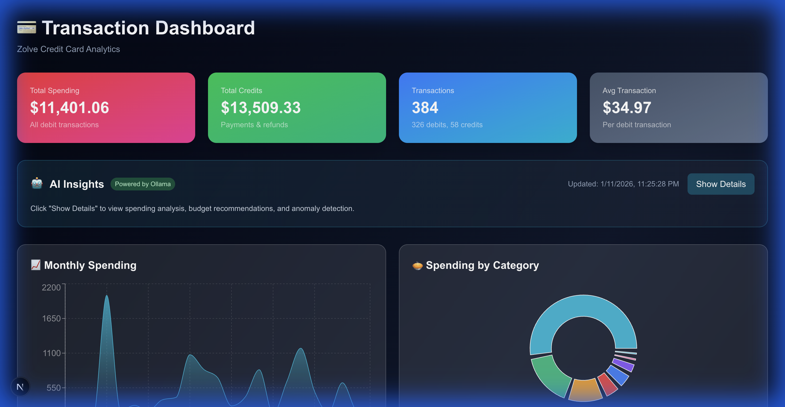
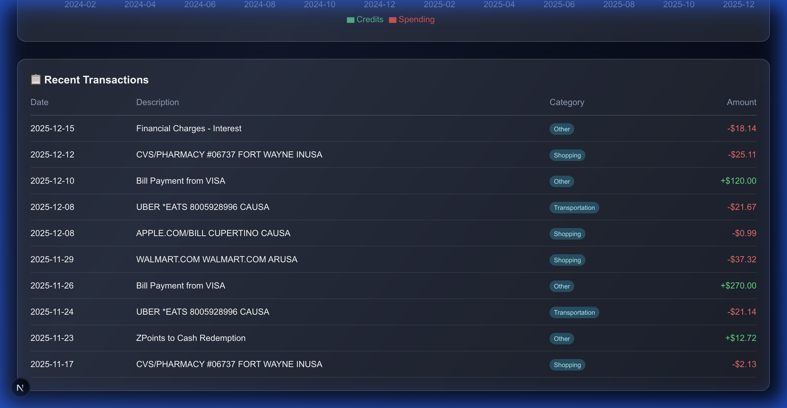
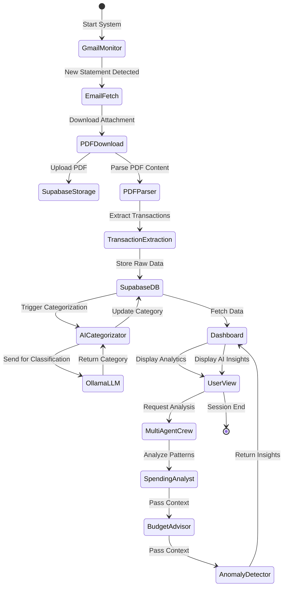

# 🏦 Agentic Ledger AI

An intelligent personal finance management system that automatically fetches credit card statements from Gmail, extracts transaction data, and categorizes spending using AI. Then it utilizes multi-agent system to analyze spending, provide budget advice, and detect anomalies.

---

## 🌟 Features

### 1. 📧 Gmail Email Fetching
Automatically connects to your Gmail account via OAuth2 to fetch credit card statement PDFs. The system monitors for new statements and downloads them for processing.

### 2. ☁️ Supabase Storage
All downloaded PDF statements are securely stored in Supabase Storage buckets, providing cloud-based backup and easy retrieval.

### 3. 📊 Database Management
Transaction metadata is extracted from PDFs and stored in a PostgreSQL database (Supabase), including:
- Transaction dates
- Descriptions
- Amounts
- Transaction types (credit/debit)
- AI-generated categories

### 4. 📈 Analytics Dashboard
A real-time Next.js dashboard providing:
- Total spending and credits overview
- Monthly spending trends
- Category-wise spending breakdown
- Credits vs debits comparison
- Recent transactions table

### 5. 🤖 Multi-Agent AI Analysis
A CrewAI-powered system with **three specialized agents** that collaborate to provide comprehensive financial insights:

| Agent | Role | Capabilities |
|-------|------|--------------|
| **Spending Analyst** | Pattern Recognition | Analyzes spending trends, identifies top categories, tracks monthly changes |
| **Budget Advisor** | Financial Planning | Provides actionable recommendations, identifies savings opportunities |
| **Anomaly Detector** | Fraud Prevention | Detects duplicate charges, flags unusually large transactions |

---

## 📸 Dashboard Screenshots

### Overview & AI Insights

*Main dashboard showing key metrics: Total Spending ($11,401), Credits ($13,509), Transaction Count (384), and AI-powered insights panel*

### Spending Analytics

*Interactive charts showing monthly spending trends, category breakdown pie chart, and credits vs debits comparison*

### Transaction Details

*Recent transactions table with date, description, AI-categorized tags, and amounts*

---

## 🔄 System Architecture



---

## 🤖 Multi-Agent System Details

### CrewAI Architecture

The multi-agent system uses **CrewAI** framework with **Ollama** (llama3.2) as the local LLM backend. Agents operate sequentially, with each agent building upon the previous agent's findings.

#### Agent 1: Spending Analyst
```
Role: Expert Financial Analyst
Goal: Analyze spending patterns and identify key insights
Tools: Get Category Stats, Get Monthly Trends, Query Transactions
Output: Spending breakdown, trend analysis, top categories
```

#### Agent 2: Budget Advisor
```
Role: Certified Financial Planner
Goal: Provide actionable budget recommendations
Tools: Get Category Stats, Get Monthly Trends
Output: Savings opportunities, practical tips, estimated savings
```

#### Agent 3: Anomaly Detector
```
Role: Fraud Detection Specialist
Goal: Identify unusual transactions and potential issues
Tools: Detect Anomalies, Query Transactions
Output: Flagged transactions table (duplicates, large purchases)
```

### Custom Tools

| Tool | Description |
|------|-------------|
| `Query Transactions` | Fetches transaction data from database with configurable limits |
| `Get Category Stats` | Returns spending breakdown by category with percentages |
| `Get Monthly Trends` | Analyzes month-over-month spending changes |
| `Detect Anomalies` | Identifies duplicates and transactions >3x average |

## 🔧 Technical Specifications

### Backend Stack

| Component | Technology | Version |
|-----------|------------|---------|
| Language | Python | 3.13 |
| LLM Framework | CrewAI | 1.8.0 |
| Local LLM | Ollama | llama3.2 |
| Database Client | Supabase-py | 2.x |
| PDF Parser | pdfplumber | 0.10.x |
| Environment | python-dotenv | 1.x |

### Frontend Stack

| Component | Technology | Version |
|-----------|------------|---------|
| Framework | Next.js | 16.1.1 |
| Language | TypeScript | 5.x |
| Styling | Tailwind CSS | 4.x |
| Charts | Recharts | 2.x |
| Database Client | @supabase/supabase-js | 2.x |

### Cloud Services

| Service | Provider | Purpose |
|---------|----------|---------|
| Database | Supabase PostgreSQL | Transaction storage |
| File Storage | Supabase Storage | PDF statement backup |
| Authentication | Google OAuth2 | Gmail API access |

### Database Schema

**Table: `transactions`**
```sql
id              UUID PRIMARY KEY
statement_id    UUID REFERENCES statements(id)
posted_date     DATE
transaction_date DATE
description     TEXT
amount          DECIMAL(10,2)
transaction_type VARCHAR(10)  -- 'credit' or 'debit'
category        VARCHAR(50)   -- AI-generated
created_at      TIMESTAMP
```

**Table: `statements`**
```sql
id              UUID PRIMARY KEY
filename        TEXT
storage_path    TEXT
statement_date  DATE
processed       BOOLEAN
created_at      TIMESTAMP
```

### API Endpoints

| Endpoint | Method | Description |
|----------|--------|-------------|
| `/api/analysis` | GET | Returns latest AI analysis results |

### Key Python Scripts

| Script | Purpose |
|--------|---------|
| `main.py` | Gmail fetcher entry point |
| `parse_statements.py` | PDF parsing and transaction extraction |
| `categorize_transactions.py` | AI categorization using Ollama |
| `analyze_spending.py` | Multi-agent analysis entry point |
| `clear_data.py` | Data cleanup utility |

### Environment Variables

```env
# Supabase
SUPABASE_URL=your_supabase_url
SUPABASE_KEY=your_supabase_key

# PDF Processing
PDF_PASSWORD=your_pdf_password

# Ollama (optional - defaults shown)
OLLAMA_URL=http://localhost:11434
OLLAMA_MODEL=llama3.2
```

---

## 📊 Performance Metrics

- **Transaction Processing**: ~100 transactions/minute
- **AI Categorization**: ~5-10 seconds per transaction (Ollama)
- **Multi-Agent Analysis**: 2-5 minutes for full report
- **Dashboard Load**: <1 second (with data cached)

---

## 🏗️ Project Structure

```
agentic-ledger-ai/
├── agents/
│   ├── __init__.py
│   ├── crew.py          # CrewAI agent definitions
│   └── tools.py         # Custom database query tools
├── dashboard/
│   ├── app/
│   │   ├── api/
│   │   │   └── analysis/
│   │   │       └── route.ts
│   │   ├── page.tsx     # Main dashboard
│   │   └── layout.tsx
│   └── lib/
│       └── supabase.ts  # Database client
├── gmail_fetcher/
│   ├── __init__.py
│   ├── config.py
│   ├── gmail_service.py
│   ├── supabase_client.py
│   └── pdf_parser.py
├── docs/
│   └── *.png            # Screenshots
├── main.py
├── parse_statements.py
├── categorize_transactions.py
├── analyze_spending.py
├── analysis_results.json
└── requirements.txt
```

---

## 📝 License

MIT License - Feel free to use and modify for personal or commercial projects.

---

<p align="center">
  Built with ❤️ using Python, Next.js, CrewAI, and Ollama
</p>